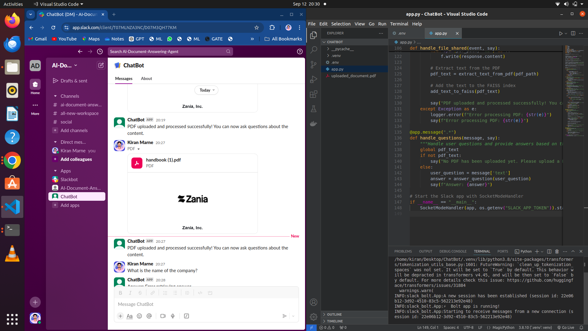

# AI Document Query Bot

A Slack bot that processes PDF documents and answers user queries based on the content of the document using OpenAI's language models and a FAISS vector database.

  <!-- Add a screenshot of the bot in action -->

## Features

- **Upload PDFs**: Seamlessly upload PDF files through Slack.
- **Text Extraction**: Extract text from PDFs and store it in a FAISS vector database.
- **Question Answering**: Use OpenAI's language model to answer questions based on the document content.
- **Error Handling**: Graceful error handling and informative messages.

## Technologies Used

- **Slack Bolt**: For interacting with Slack API.
- **OpenAI**: For natural language processing and generating responses.
- **FAISS**: For efficient similarity search and text indexing.
- **Transformers**: For encoding text using transformer models.
- **PyPDF2**: For extracting text from PDF files.
- **Python**: For the implementation.

## Installation

Follow these steps to set up and run the project:

1. **Clone the repository**

   ```bash
   git clone https://github.com/yourusername/ai-document-query-bot.git

## Requirements
Python 3.7+: Ensure Python 3.7 or higher is installed on your machine.
Virtual Environment: It's recommended to use a virtual environment to manage dependencies.

## Configuration
Slack Setup:
Create a Slack app and obtain the bot token and app token.
Add the bot to your Slack workspace and ensure it has permission to read messages and access files.

OpenAI API Key:
Sign up for OpenAI and generate an API key.

Environment Variables:
Add your credentials to the .env file as shown in the installation step.

## Usage
1.Upload a PDF file: Send a PDF document to any Slack channel or direct message where the bot is present.
2.Ask Questions: Type questions related to the content of the uploaded PDF. The bot will respond with answers based on the document content.


